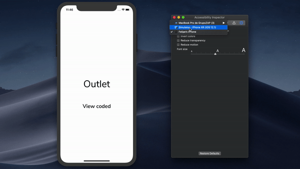

Example of how to set up a project with dynamic text size and custom fonts.

Related to Swift Marino: [Dynamic Type with custom fonts in iOS](https://swiftmarino.com/2019/03/10/dynamic-type-with-custom-fonts-in-ios/)

 
  
For details on how to debug dynamic font size:

`Xcode > Open Developer Tools > Accessibility Inspector`  

